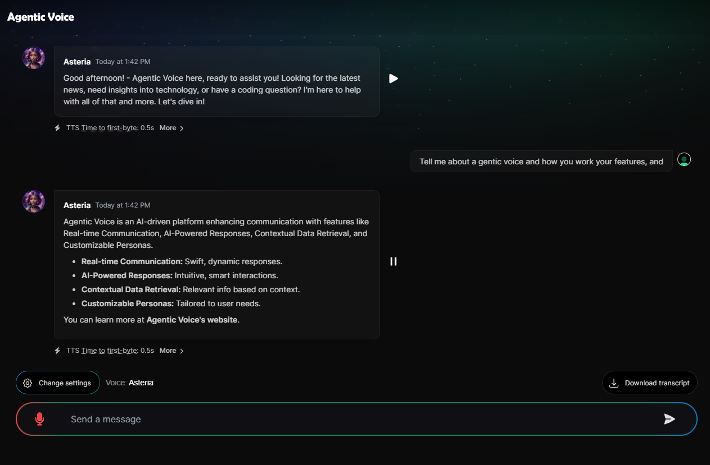

# Agentic Voice AI Assistant

[](https://voice.ruv.io)

Agentic Voice is an advanced AI-powered chat application designed for seamless real-time communication and intelligent responses. Built with Next.js, OpenAI, Deepgram, and Exa API, it leverages cutting-edge technologies to enhance user interactions and provide contextual, relevant information dynamically.

🎤 https://voice.ruv.io 

### Features

- **Real-time Communication**: Engage in smooth, responsive chat sessions.
- **AI-Powered Responses**: Utilize OpenAI's GPT-4 models for intelligent, context-aware replies.
- **Contextual Data Retrieval**: Integrate Exa API to fetch and incorporate relevant data into conversations.
- **Customizable Personas**: Tailor chat assistant personas to match specific needs and scenarios.
- **Advanced Speech Detection**: Implement optimized settings for effective voice activity detection and noise suppression, ensuring clear and accurate speech recognition.
- **Open Source and Customizable**: Fully open-source with the ability to customize features and functionalities.
  
## Use Cases

### Customer Support

Leverage Agentic Voice to provide real-time, AI-driven customer support. With intelligent voice and chat capabilities, customers can get immediate answers to their queries, leading to improved satisfaction and reduced response times.

### Healthcare

Implement Agentic Voice in healthcare settings for patient interaction, appointment scheduling, and information dissemination. The AI-powered system can provide timely responses and manage routine inquiries, allowing healthcare professionals to focus on critical tasks.

### Education

Use Agentic Voice in educational institutions for interactive learning experiences. The platform can assist with answering questions, providing educational content, and supporting virtual classroom interactions, enhancing the overall learning experience.

### Finance

Integrate Agentic Voice into financial services for real-time customer engagement and support. The system can handle inquiries about account information, transaction details, and financial advice, ensuring a seamless and secure customer experience.

### Retail

Enhance the retail experience by using Agentic Voice to offer personalized shopping assistance. Customers can get recommendations, check product availability, and manage their orders through interactive and intelligent voice and chat support.

### Entertainment

Incorporate Agentic Voice into entertainment platforms for enhanced user engagement. The AI assistant can provide updates on the latest shows, manage subscriptions, and offer personalized content recommendations, making the user experience more dynamic and engaging.

### Technology

Utilize Agentic Voice in the tech industry for technical support and troubleshooting. The platform can assist with coding questions, software issues, and provide up-to-date technology news, helping users stay informed and solve problems efficiently.

## Installation

### Prerequisites

- Node.js (v18 LTS recommended)
- npm (included with Node.js)

### Steps

1. **Clone the repository:**

   ```bash
   git clone https://github.com/ruvnet/agentic-voice.git
   cd agentic-voice
   ```

2. **Run the installation script:**

   Make sure the installation script is executable and run it:

   ```bash
   chmod +x ./scripts/install.sh
   ./scripts/install.sh
   ```

   The script will:

   - Update the package list and install prerequisites.
   - Install Node.js 18 LTS.
   - Verify the installation of Node.js and npm.
   - Navigate to the project directory.
   - Install project dependencies.
   - Prompt for Deepgram, OpenAI, and Exa API keys and create a `.env.local` file.

# Advanced
### Setting Up Local Environment Variables

To ensure Agentic Voice functions correctly, you need to set up local environment variables. This involves creating a `.env.local` file in the root directory of your project and adding the necessary API keys. Follow these steps:

1. **Navigate to the Project Directory:**

   Open your terminal and navigate to the root directory of the `agentic-voice` project.

   ```bash
   cd /path/to/agentic-voice
   ```

2. **Create the `.env.local` File:**

   Create a file named `.env.local` in the root directory of your project.

   ```bash
   touch .env.local
   ```

3. **Add Environment Variables:**

   Open the `.env.local` file in a text editor and add your API keys. The required keys are for Deepgram, OpenAI, and Exa API. Here is an example of what the file should look like:

   ```plaintext
   DEEPGRAM_STT_DOMAIN=https://api.deepgram.com
   DEEPGRAM_API_KEY=your_deepgram_api_key_here
   OPENAI_API_KEY=your_openai_api_key_here
   EXASEARCH_API_KEY=your_exa_api_key_here
   ```

   Replace `your_deepgram_api_key_here`, `your_openai_api_key_here`, and `your_exa_api_key_here` with your actual API keys.

4. **Save and Close:**

   Save the `.env.local` file and close the text editor.

5. **Verify Setup:**

   Ensure the environment variables are loaded correctly by restarting your development server:

   ```bash
   npm run dev
   ```

### Additional Configuration

If you need to add more environment variables or change existing ones, simply edit the `.env.local` file. The application will automatically load these variables when it starts.

By correctly setting up your environment variables, you ensure that Agentic Voice can securely and efficiently interact with the required APIs, providing a seamless user experience.


## Customizing Keywords

To customize the keywords used by Agentic Voice, modify the `keywords.js` file located at `/agentic-voice/app/api/utils/keywords.js`. You can add, remove, or change the keywords and their associated phrases.

```javascript
const keywords = {
  // Add broad trigger keywords or phrases here
  "weather": ["weather", "temperature", "forecast", "climate"],
  "news": ["news", "headlines", "current events", "breaking news"],
  "sports": ["sports", "game", "score", "team"],
  "finance": ["stock", "market", "investment", "finance", "economy"],
  "technology": ["technology", "tech", "gadget", "innovation"],
  "entertainment": ["movie", "music", "entertainment", "show", "concert"],
  "health": ["health", "wellness", "medicine", "fitness"],
  "travel": ["travel", "vacation", "trip", "destination"],
  "food": ["food", "recipe", "cuisine", "restaurant"],
  "education": ["education", "learning", "school", "course"],
  "ai": ["ai", "artificial intelligence", "machine learning", "deep learning"],
  "developer": ["developer", "programming", "coding", "software", "github", "npm", "python", "javascript"],
};

/**
 * Extract keywords from user messages.
 * @param {Array} messages - Array of user messages.
 * @returns {Array} - Array of extracted keywords.
 */
function extractKeywords(messages) {
  const extractedKeywords = [];
  const messageContent = messages.map(message => message.content.toLowerCase()).join(' ');

  for (const [category, words] of Object.entries(keywords)) {
    words.forEach(word => {
      if (messageContent.includes(word)) {
        extractedKeywords.push(category);
      }
    });
  }

  return extractedKeywords;
}

module.exports = {
  keywords,
  extractKeywords
};
```
### Speech Detection Settings

The `MicrophoneContextProvider` script includes optimized settings for speech detection to enhance performance in various environments:

- **Client-side Execution**: Ensures proper client-side execution with the `"use client"` directive placed at the top of the file, enabling full functionality on the client side.

- **Sensitivity and Thresholds**: Configures a `DEFAULT_SENSITIVITY` value of `0.2` to adjust the gain for loud environments and a `VAD_THRESHOLD` of `0.025` to accurately detect voice activity while minimizing false positives from background noise.

- **Noise Gate**: Includes a `NOISE_GATE_THRESHOLD` variable (currently commented out) for potential use. This variable can be activated to add an additional layer of filtering for non-speech sounds, further improving the clarity of detected speech.

- **Audio Processing**: Utilizes audio processing nodes such as gain and biquad filters. The gain node adjusts microphone sensitivity, while the biquad filter is set to a low-pass configuration with a frequency of 1000 Hz to target the typical range of human speech. These nodes work together to enhance speech detection and suppress unwanted noise.

#### Configuration

File: `./app/context/microphone.tsx`

```javascript
const DEFAULT_SENSITIVITY = 0.5; // Default sensitivity value to capture most sounds effectively
// Example values for different use cases:
// const DEFAULT_SENSITIVITY = 0.6; // Higher sensitivity for quieter environments
// const DEFAULT_SENSITIVITY = 0.3; // Lower sensitivity for louder environments

const VAD_THRESHOLD = 0.01; // Moderate threshold for detecting speech
// Example values for different use cases:
// const VAD_THRESHOLD = 0.005; // Lower threshold to capture softer speech
// const VAD_THRESHOLD = 0.015; // Higher threshold to filter out more background noise

const NOISE_GATE_THRESHOLD = 0.001; // Noise gate threshold to filter out non-speech sounds
// Example values for different use cases:
// const NOISE_GATE_THRESHOLD = 0.05; // Lower threshold for less strict noise filtering
// const NOISE_GATE_THRESHOLD = 0.2; // Higher threshold for more strict noise filtering
```

## Updating API Endpoints and Integrating Data Sources

The primary API endpoint logic is located in the `route.ts` file at `/agentic-voice/app/api/brain/route.ts`. Here’s an overview of how to modify it:

1. **Filtering Keywords:** Ensure only relevant keywords are processed.
2. **API Integration:** Customize the API calls to integrate different data sources.
3. **Response Handling:** Adjust the way responses are generated based on the retrieved data.

### Example Overview of `route.ts`

```typescript
import OpenAI from "openai";
import { OpenAIStream, StreamingTextResponse } from "ai";
import { extractKeywords } from "../utils/keywords";

const openai = new OpenAI({
  apiKey: process.env.OPENAI_API_KEY!,
});

export const runtime = "edge";

const TARGET_KEYWORDS = ['news', 'sports', 'technology', 'entertainment', 'food', 'education'];

async function searchExaAPI(keyword: string, apiKey: string, numResults: number = 5) {
  const response = await fetch('https://api.exa.ai/search', {
    method: 'POST',
    headers: {
      'Accept': 'application/json',
      'Content-Type': 'application/json',
      'x-api-key': apiKey,
    },
    body: JSON.stringify({ query: keyword, numResults })
  });

  const data = await response.json();
  console.log(`searchExaAPI response for keyword "${keyword}":`, data);

  if (!data.results) {
    throw new Error('No results found in Exa API response');
  }

  return data;
}

async function getContentsExaAPI(ids: string[], apiKey: string) {
  const response = await fetch('https://api.exa.ai/contents', {
    method: 'POST',
    headers: {
      'Accept': 'application/json',
      'Content-Type': 'application/json',
      'x-api-key': apiKey,
    },
    body: JSON.stringify({ ids })
  });

  const data = await response.json();
  console.log("getContentsExaAPI response:", data);

  if (!data.results) {
    throw new Error('No results found in Exa API response');
  }

  return data;
}

export async function POST(req: Request) {
  try {
    console.log("Request received at:", new Date().toISOString());

    const { messages } = await req.json();
    console.log("Messages extracted:", messages);

    const start = Date.now();
    const keywords = extractKeywords(messages);
    console.log("Keywords extracted:", keywords);

    // Filter keywords to include only target keywords
    const filteredKeywords = keywords.filter(keyword => TARGET_KEYWORDS.includes(keyword));
    console.log("Filtered keywords:", filteredKeywords);

    // Perform search using Exa API with the filtered keywords
    const searchResults = await Promise.all(
      filteredKeywords.map(async (keyword) => {
        try {
          return await searchExaAPI(keyword, process.env.EXASEARCH_API_KEY!, 5);
        } catch (error) {
          console.error(`Error searching Exa API for keyword "${keyword}":`, error);
          return { results: [] };
        }
      })
    );

    const ids = searchResults.flatMap(result => result.results?.map((res: any) => res.id) || []);
    console.log("Search results IDs:", ids);

    // Fallback message if no IDs are found
    if (ids.length === 0) {
      const fallbackMessage = "No relevant content found for the keywords provided.";
      console.log(fallbackMessage);
      const response = await openai.chat.completions.create({
        model: "gpt-4o",
        stream: true,
        messages: [
          ...messages,
          {
            role: "system",
            content: fallbackMessage
          }
        ],
      });
      console.log("OpenAI fallback response created");

      const stream = OpenAIStream(response);
      console.log("OpenAI response stream created");

      return new StreamingTextResponse(stream, {
        headers: {
          "X-LLM-Start": `${start}`,
          "X-LLM-Response": `${Date.now()}`,
        },
      });
    }

    // Get the content based on search results
    const exaApiResponse = await getContentsExaAPI(ids.slice(0, 5), process.env.EXASEARCH_API_KEY!); // Limit to 5 contents
    console.log("Exa API response:", exaApiResponse);

    const retrievedData = exaApiResponse.results.map((result: any) => ({
      id: result.id,
      url: result.url,
      title: result.title,
      author: result.author,
      text: result.text.slice(0, 500), // Limit text to 500 characters
    }));

    // Use the retrieved data to generate contextually relevant responses
    const response = await openai.chat.completions.create({
      model: "gpt-4o",
      stream: true,
      messages: [
        ...messages,
        {
          role: "system",
          content: `Here is an overview of the retrieved data: ${JSON.stringify(retrievedData)}`
        }
      ],
    });
    console.log("OpenAI response created");

    const stream = OpenAIStream(response);
    console.log("OpenAI response stream created");

    return new StreamingTextResponse(stream, {
      headers: {
        "X-LLM-Start": `${start}`,
        "X-LLM-Response": `${Date.now()}`,
      },
    });
  } catch (error) {
    console.error("Error generating response with RAG structure", error);
    return new Response("Internal Server Error", { status: 500 });
  }
}
```

## Usage

- Access the chat interface at the provided URL.
- Interact with the AI assistant, which uses the configured APIs to provide intelligent, context-aware responses.

## Deployment

To deploy the app for production, follow these steps:

1. **

Build the project:**

   ```bash
   npm run build
   ```

2. **Start the server:**

   ```bash
   npm start
   ```

   Ensure all environment variables are set appropriately in the production environment.

## Contributing

Contributions are welcome! Please follow these steps to contribute:

1. Fork the repository.
2. Create a new branch (`git checkout -b feature/YourFeature`).
3. Make your changes.
4. Commit your changes (`git commit -m 'Add some feature'`).
5. Push to the branch (`git push origin feature/YourFeature`).
6. Open a pull request.

## License

This project is licensed under the MIT License. See the [LICENSE](LICENSE) file for details.

## Acknowledgements

- [Next.js](https://nextjs.org/)
- [OpenAI](https://openai.com/)
- [Exa API](https://exa.ai/)
- [Deepgram](https://deepgram.com/)

For any questions or support, please open an issue in the [GitHub repository](https://github.com/ruvnet/agentic-voice).
