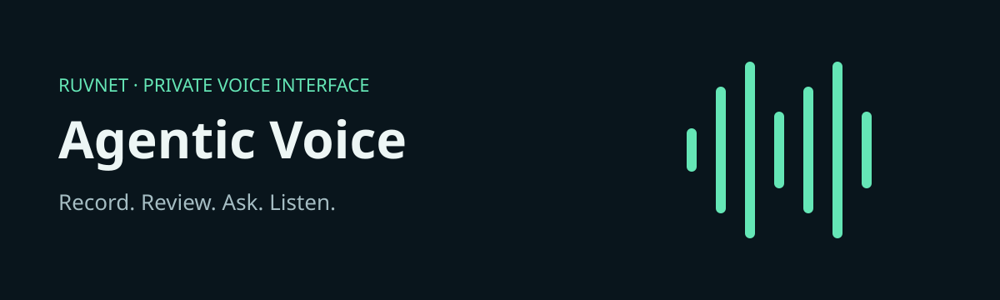

# Agentic Voice v2 alpha

Ask a question using text or a short microphone recording, read the assistant's response as it arrives, and hear the answer. This revival replaces the 2024 prototype with a smaller, authenticated application and a local agent interface for maintaining it.

| Capability | Implementation | Boundary |
| --- | --- | --- |
| Live text | OpenAI SDK stream | 32 messages, 512 output tokens, 20 second deadline |
| Voice input | Browser MediaRecorder and Deepgram transcription | 30 second recordings; 1 MiB upload; review transcript before sending |
| Spoken answers | Deepgram audio | Buffered MP3, 2 MiB maximum |
| Access control | Server token and exact Origin | Token at least 32 characters; stored only in page memory |
| Agent maintenance | Repo CLI and MCP | Fixed local evaluations, sanitized child environment, no provider secrets |
| Improvement harness | MetaHarness and Autogenous | Local evidence; no automatic production promotion |

## Install and run

Requires Node 24 and npm. First revoke the provider credential historically embedded in browser source. Deleting it from current files does not revoke it or erase Git history. Track operator qualification in [issue 3](https://github.com/ruvnet/agentic-voice/issues/3).

```sh
npm ci --prefix agentic-voice
cp agentic-voice/.env.example agentic-voice/.env.local
# Edit .env.local with new private credentials and an independently generated access token.
npm run build --prefix agentic-voice
npm start --prefix agentic-voice
```

Open http://localhost:3000 and enter the same session access token. The configured `VOICE_ORIGIN` must exactly match the browser origin. Record voice, stop to transcribe, review the text, then send. Stop cancels the response and pauses playback. No session recorder, analytics, or transcript logging is installed.

This is a private single operator deployment. Put an authenticated gateway with shared quotas and a provider spending cap in front of an Internet deployment. The per process concurrency limit is four. It is not a distributed spending limit.

## CLI and MCP

```sh
npm ci --prefix .harness/runtime
node .harness/runtime/cli.mjs status
VOICE_ALLOW_VALIDATION=1 node .harness/runtime/cli.mjs test
VOICE_ALLOW_VALIDATION=1 node .harness/runtime/cli.mjs benchmark
node .harness/runtime/cli.mjs mcp
```

MCP exposes `voice_status`, `voice_validate`, `voice_benchmark`, `voice_receipts`, and `ruv://agentic-voice/policy`. Evaluations require operator opt in. Receipts contain unsigned output hashes, remain in memory, and do not establish independent correctness. MCP accepts no shell commands, filesystem paths, or provider requests.

## Validation

```sh
npm test --prefix agentic-voice
npm run build --prefix agentic-voice
npm run smoke --prefix agentic-voice
npm test --prefix .harness/runtime
npm audit --prefix agentic-voice
npm audit --prefix .harness/runtime
```

Tests use controlled provider fixtures and exercise a real production Next server. Live provider audio quality, microphone permission behavior, acoustic interruption latency, and token revocation require operator qualification. The local benchmark measures message validation only; it does not measure model or network latency.

See [architecture decision](docs/ADR-001-secure-revival.md) and [security model](SECURITY.md). The former automatic microphone conversation, Exa search enrichment, voice selection, analytics, and unsafe key handling have been retired. The supported flow is explicit recording, transcript review, streamed answer, and buffered playback.

## Related projects

[RuFlo](https://github.com/ruvnet/ruflo) coordinates agents. [MetaHarness](https://github.com/ruvnet/metaharness) supplies agent profiles and evaluation workflows. [Autogenous](https://github.com/ruvnet/autogenous) supplies governance primitives. [RuVector](https://github.com/ruvnet/ruvector) supplies retrieval infrastructure. [AgentBBS](https://github.com/ruvnet/AgentBBS) and [RuFlo federation](https://x.ruv.io) support collaboration. The local MCP makes no federation publications and receives no federation credentials.
